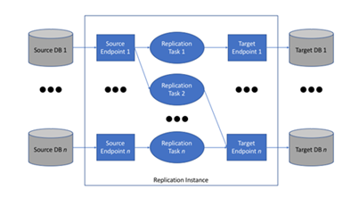
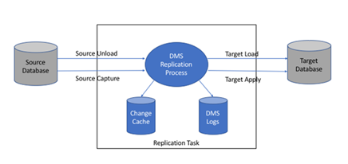

**AWS Database Migration Service의 작동 방식**

AWS Database Migration Service(AWS DMS)는 원본 데이터 스토어에서 대상 데이터 스토어로 마이그레이션하는 데 사용할 수 있는 `웹 서비스`입니다. 이러한 두 데이터 스토어는 엔드포인트라고 합니다.
Oracle 데이터베이스에서 Oracle 데이터베이스로와 같이 동일한 데이터베이스 엔진을 사용하는 원본 및 대상 엔드포인트를 마이그레이션할 수 있습니다.
Oracle 데이터베이스에서 PostgresSQL 데이터베이스로와 같이 다른 데이터베이스 엔진을 사용하는 원본 및 대상 엔드포인트를 마이그레이션할 수 있습니다. AWS DMS 사용할 경우 요구되는 한 가지는 AWS 서비스에 자체 엔드포인트 중 하나가 존재해야 한다는 것입니다.
`AWS DMS를 사용하여 온프레미스 데이터베이스에서 다른 온프레미스 데이터베이스로 마이그레이션할 수 없습니다.`

데이터베이스 마이그레이션 비용에 대한 정보는 [AWS Database Migration Service 요금 페이지](https://aws.amazon.com/dms/pricing/)를 참조하십시오.

AWS DMS에 대해 더 잘 이해하려면 다음 주제를 참조하십시오.

항목

- [AWS DMS의 상위 수준 보기](https://docs.aws.amazon.com/ko_kr/dms/latest/userguide/CHAP_Introduction.html#CHAP_Introduction.HighLevelView)
- [AWS Database Migration Service 구성 요소](https://docs.aws.amazon.com/ko_kr/dms/latest/userguide/CHAP_Introduction.Components.html)
- [AWS Database Migration Service용 원본](https://docs.aws.amazon.com/ko_kr/dms/latest/userguide/CHAP_Introduction.Sources.html)
- [AWS Database Migration Service용 대상](https://docs.aws.amazon.com/ko_kr/dms/latest/userguide/CHAP_Introduction.Targets.html)
- [다른 AWS 서비스와 함께 AWS DMS 사용](https://docs.aws.amazon.com/ko_kr/dms/latest/userguide/CHAP_Introduction.AWS.html)

**AWS DMS의 상위 수준 보기**

데이터베이스 마이그레이션을 수행하기 위해 AWS DMS에서는 원본 데이터 스토어에 연결하고, 원본 데이터를 읽고, 대상 데이터 스토어에서 사용할 수 있도록 데이터 형식을 지정합니다. 그런 다음 데이터를 대상 데이터 스토어에 로드합니다. 이러한 처리 대다수는 메모리에서 나타나지만, 큰 트랜잭션에는 디스크로의 일부 버퍼링이 필요할 수 있습니다. 캐시된 트랜잭션과 로그 파일도 디스크에 기록됩니다.

상위 수준에서 AWS DMS를 사용할 때에는 다음 작업을 수행합니다.

- 복제 서버를 생성합니다.
- 데이터 스토어에 대한 연결 정보가 있는 소스 및 대상 엔드포인트를 생성합니다.
- 하나 이상의 마이그레이션 작업을 생성하여 원본과 대상 데이터 스토어 간 데이터를 마이그레이션합니다.

작업은 세 가지 주요 단계로 구성되어 있습니다.

- 기존 데이터의 전체 로드
- 캐시된 변경 사항 적용
- 지속적 복제

원본의 기존 데이터가 대상으로 이전되는 전체 로드 마이그레이션 도중 AWS DMS는 원본 데이터 스토어에 있는 테이블의 데이터를 대상 데이터 스토어에 있는 테이블로 로드합니다. 전체 로드가 진행되는 동안 로드 중인 테이블에 적용된 변경 사항은 복제 서버에서 캐시되고, 이것은 캐시된 변경 사항입니다. 이 테이블의 전체 로드가 시작될 때까지 AWS DMS에서 지정된 테이블에 대한 변경 내용을 캡처하지 않는다는 점을 잘 알고 있어야 합니다. 즉, 변경 캡처가 시작되는 시점은 각 테이블별로 다릅니다.

지정된 테이블의 전체 로드가 완료되면, AWS DMS는 즉시 이 테이블의 캐시된 변경 사항을 적용하기 시작합니다. 모든 테이블이 로드되면, AWS DMS는 진행 중인 복제 단계의 트랜잭션으로서 변경 사항을 수집하기 시작합니다. AWS DMS가 모든 캐시된 변경 사항을 적용한 후 테이블은 트랜잭션에서 일관성이 있습니다. 이 시점에서 AWS DMS는 지속적 복제 단계로 이동하고 트랜잭션으로서 변경 사항을 적용합니다.

지속적 복제 단계가 시작되면, 트랜잭션의 백로그는 일반적으로 원본과 대상 데이터베이스 사이에서 일부 지연 시간을 유발합니다. 결국 마이그레이션은 이 트랜잭션 백로그를 통해 진행된 후 일정한 상태에 도달합니다. 이 시점에서 애플리케이션을 종료하고, 남은 트랙잭션을 대상에 적용하도록 허용하고, 애플리케이션을 불러오면 이제 대상 데이터베이스를 가리킵니다.

AWS DMS는 마이그레이션을 수행하는 데 필요한 대상 스키마 객체를 생성합니다. 그렇지만, AWS DMS는 미니멀리스트 접근 방식을 취하고 데이터를 효율적으로 마이그레이션하는 데 필요한 해당 객체만을 생성합니다. 즉, AWS DMS는 테이블과 기본 키를 생성하고 경우에 따라 고유 인덱스도 생성하지만, 소스의 데이터를 효율적으로 마이그레이션하는 데 필요하지 않은 다른 객체를 생성하지 않습니다. 예를 들어 보조 인덱스, 기본이 아닌 키 제약 조건 또는 데이터 기본값을 생성하지 않습니다.

대부분의 경우 마이그레이션을 수행할 때는 대부분 또는 전체 원본 스키마도 마이그레이션합니다. 같은 유형의 마이그레이션(동일한 엔진 유형의 데이터베이스 2개 사이)을 수행하는 경우, 엔진의 기본 도구를 사용하여 데이터 없이 스키마 자체를 내보내고 가져와 스키마를 마이그레이션합니다.

마이그레이션이 다른 유형인 경우(다른 엔진 유형을 사용하는 데이터베이스 2개), AWS Schema Conversion Tool(AWS SCT)을 사용하여 전체 대상 스키마를 자동으로 생성할 수 있습니다. 도구를 사용하는 경우, 외래 키 제약과 같은 테이블 간 종속성은 마이그레이션의 "전체 로드"와 "캐시된 변경 적용" 단계 중에 비활성화되어야 합니다. 성능이 문제인 경우, 마이그레이션 프로세스 중에 보조 인덱스를 제거 또는 비활성화하면 도움이 됩니다. AWS SCT에 대한 자세한 내용은 AWS SCT 설명서의 [AWS 스키마 변환 도구](https://docs.aws.amazon.com/SchemaConversionTool/latest/userguide/CHAP_SchemaConversionTool.Installing.html)를 참조하십시오.

**AWS Database Migration Service 구성 요소**

이 단원에서는 AWS DMS의 내부 구성 요소와 이들 구성 요소가 어떻게 함께 작동하여 데이터 마이그레이션을 완수하는지 설명합니다. AWS DMS의 기본 구성 요소를 이해하면 데이터를 더 효율적으로 마이그레이션할 수 있고 문제를 해결하거나 원인을 파악할 때 문제를 더 심도 있게 파악할 수 있습니다.

AWS DMS 마이그레이션은 `세 가지 구성 요소, 즉 복제 인스턴스, 원본 및 대상 엔드포인트, 복제 작업`으로 이루어집니다. 사용자는 AWS 리전에 필요한 복제 인스턴스, 엔드포인트, 작업을 생성하여 AWS DMS 마이그레이션을 생성합니다.

**복제 인스턴스**

상위 수준에서 AWS DMS 복제 인스턴스는 복제 작업을 한 개 이상 호스팅하는 관리형 Amazon Elastic Compute Cloud(Amazon EC2) 인스턴스일 뿐입니다.

다음 그림은 몇 가지 연결된 복제 작업을 실행하는 복제 인스턴스의 예시입니다.

복제 인스턴스 하나는 마이그레이션의 성격과 복제 서버의 용량에 따라 복제 작업을 한 개 이상 호스팅할 수 있습니다. AWS DMS에서는 다양한 복제 인스턴스를 제공하므로 사용자는 사용 사례에 가장 적합한 구성을 선택할 수 있습니다. 복제 인스턴스의 다양한 클래스에 대한 자세한 내용은 []마이그레이션에 적합한 AWS DMS 복제 인스턴스 선택](https://docs.aws.amazon.com/ko_kr/dms/latest/userguide/CHAP_ReplicationInstance.html#CHAP_ReplicationInstance.InDepth) 단원을 참조하십시오.

AWS DMS는 Amazon Elastic Compute Cloud(Amazon EC2) 인스턴스에 복제 인스턴스를 생성합니다. 소형 인스턴스 클래스 중에는 서비스를 테스트하거나 소규모 마이그레이션을 하기에 충분한 것이 있습니다. 마이그레이션에 대량의 테이블이 포함되어 있는 경우 또는 여러 동시 복제 작업을 실행해야 하는 경우, 대형 인스턴스 중 하나를 사용하는 것이 좋습니다. AWS DMS는 상당량의 메모리와 CPU를 소모할 수 있으므로 이 접근 방식을 권장합니다.

사용자가 선택하는 Amazon EC2 인스턴스 클래스에 따라 복제 인스턴스에는 50GB 또는 100GB의 데이터 스토리지가 포함되어 있습니다. 대개 이 정도 크기면 대부분 고객에게 충분합니다. 그러나 마이그레이션에 대규모 트랜잭션 또는 대량 데이터 변경 사항이 포함되어 있다면 기본 스토리지 할당을 늘리고 싶을 것입니다. 변경 데이터 캡처(CDC)로 인해 데이터가 디스크에 쓰일 수 있는데, 이는 대상이 변경 사항을 쓰는 속도에 달려 있습니다.

AWS DMS는 다중 AZ 배포를 사용해 고가용성과 장애 조치 기능을 지원합니다. 다중 AZ 배포에서 AWS DMS는 다른 가용 영역에 복제 인스턴스의 대기 복제본을 자동으로 프로비저닝하고 유지합니다. 기본 복제 인스턴스는 대기 복제본에 동기식으로 복제됩니다. 기본 복제 인스턴스에 장애가 발생하거나 무응답 상태가 되면 대기 복제본은 중단을 최소화하면서 실행 중이던 작업을 다시 시작합니다. 기본 복제본은 자신의 상태를 끊임없이 대기 복제본으로 복제하기 때문에 다중 AZ 배포는 약간의 성능 오버헤드를 발생시킵니다.

AWS DMS 복제 인스턴스에 대한 자세한 내용은 [AWS DMS 복제 인스턴스 작업 사용](https://docs.aws.amazon.com/ko_kr/dms/latest/userguide/CHAP_ReplicationInstance.html) 섹션을 참조하십시오.

**엔드포인트**

AWS DMS는 엔드포인트를 사용하여 원본 또는 대상 데이터 스토어에 액세스합니다. 구체적인 연결 정보는 데이터 스토어에 따라 다르지만, 일반적으로 사용자는 엔드포인트 생성 시 다음과 같은 정보를 제공합니다.

- 엔드포인트 유형 — 원본 또는 대상.
- 엔진 유형 — Oracle, Postgres, Amazon S3와 같은 데이터베이스 엔진의 유형
- 서버 이름 — AWS DMS에서 연결할 수 있는 서버 이름 또는 IP 주소.
- 포트 — 데이터베이스 서버 연결에 사용되는 포트 번호.
- 암호화 — SSL 모드(연결 암호화에 사용되는 경우).
- 자격 증명 — 필수 액세스 권한이 있는 계정의 사용자 이름 및 암호.

AWS DMS 콘솔을 사용해 엔드포인트를 생성할 때 콘솔에서는 사용자에게 엔드포인트 연결을 테스트할 것을 요구합니다. 이 테스트의 결과가 성공적이어야 DMS 작업에서 엔드포인트를 사용할 수 있습니다. 연결 정보와 마찬가지로 구체적인 테스트 기준은 엔진 유형에 따라 다릅니다. 일반적으로 AWS DMS에서는 주어진 서버 이름 및 포트에 데이터베이스가 있는지, 제공된 자격 증명을 마이그레이션을 수행하는 데 필요한 권한이 있는 데이터베이스에 연결하는 데 사용할 수 있는지 확인합니다. 연결 테스트 결과가 성공적이면 AWS DMS에서는 나중에 작업 구성 중에 사용할 수 있는 테이블 정의, 기본/고유 키 정의 등 스키마 정보를 다운로드하여 저장합니다.

2개 이상의 복제 작업에서 엔드포인트 하나를 사용할 수 있습니다. 예를 들어 동일한 원본 데이터베이스에서 호스팅되는 논리적으로 구분된 애플리케이션이 두 개 있는데, 사용자가 이를 서로 구분하여 마이그레이션하고자 하는 경우가 있을 수 있습니다. 애플리케이션 테이블 각 세트에 대해 하나씩, 도합 두 개의 복제 작업을 생성할 수 있지만, 두 작업 모두에 동일한 AWS DMS 엔드포인트를 사용할 수 있습니다.

사용자는 추가 연결 속성을 사용하여 엔드포인트의 동작을 사용자 지정할 수 있습니다. 이 속성을 통해 로깅에 관한 세부 정보, 파일 크기, 기타 파라미터 등 다양한 동작을 제어할 수 있습니다. 각 데이터 스토어 엔진 유형에는 사용 가능한 여러 가지 추가 연결 속성이 있습니다. 데이터 스토어의 원본 혹은 대상 섹션에서 이 데이터 스토어 각각의 특정 추가 연결 속성을 찾을 수 있습니다. 지원되는 원본 및 대상 데이터 스토어 목록은 [AWS Database Migration Service용 원본](https://docs.aws.amazon.com/ko_kr/dms/latest/userguide/CHAP_Introduction.Sources.html) 및 [AWS Database Migration Service용 대상](https://docs.aws.amazon.com/ko_kr/dms/latest/userguide/CHAP_Introduction.Targets.html) 섹션을 참조하십시오.

AWS DMS 엔드포인트에 대한 자세한 내용은 [AWS DMS 엔드포인트 작업 사용](https://docs.aws.amazon.com/ko_kr/dms/latest/userguide/CHAP_Endpoints.html) 단원을 참조하십시오.

**복제 작업**

AWS DMS 복제 작업을 사용하여 소스 엔드포인트에서 대상 엔드포인트로 데이터 세트를 이동합니다. 복제 작업 생성은 마이그레이션을 시작하기 전에 수행해야 할 최종 단계입니다.

복제 작업을 생성할 때 다음 작업 설정을 지정합니다.

- 복제 인스턴스 – 작업을 호스팅하고 실행할 인스턴스
- 원본 엔드포인트
- 대상 엔드포인트
- 마이그레이션 유형 옵션 – 마이그레이션 유형은 다음 중 하나일 수 있습니다.
  - 전체 로드(기존 데이터 마이그레이션) – 기존 데이터를 복사할 수 있을 정도로 긴 중단을 감당할 수 있는 경우 이 옵션이 적합합니다. 이 옵션은 간단히 원본 데이터베이스에서 대상 데이터 베이스로 데이터를 마이그레이션하여 필요할 경우 테이블을 생성합니다.
  - 전체 로드 및 CDC(기존 데이터를 마이그레이션하고 지속적 변경 사항 복제) – 이 옵션을 선택하면 원본에서 변경 사항을 캡처하는 동안 전체 데이터 로드를 수행합니다. 전체 로드가 완료되고 나면, 캡처된 변경 사항이 대상에 적용됩니다. 결과적으로 변경 사항 적용은 안정적인 상태에 도달합니다. 이 시점에서 애플리케이션을 종료할 수 있고, 남은 변경 사항이 대상으로 흐르도록 한 후 대상을 나타내는 애플리케이션을 다시 시작할 수 있습니다.
  - CDC 전용(데이터 변경 사항만 복제) – 경우에 따라서는 AWS DMS 이외의 방법을 사용하여 기존 데이터를 복사하는 것이 더 효율적일 수 있습니다. 예를 들어 같은 유형의 마이그레이션에서 기본 내보내기/가져오기 도구를 사용하면 대량 데이터를 로드하기에 더 효과적일 수 있습니다. 이 상황에서 AWS DMS를 사용하여 대량 로드를 시작하여 원본과 대상 데이터베이스를 가져와 동기화를 유지할 때 시작하는 변경 사항을 복제할 수 있습니다.

  마이그레이션 유형 옵션에 대한 자세한 설명은 [작업 생성](https://docs.aws.amazon.com/ko_kr/dms/latest/userguide/CHAP_Tasks.Creating.html)을 참조하십시오.

- 대상 테이블 준비 모드 옵션. 대상 테이블 모드에 관한 완전한 설명을 보려면 [작업 생성](https://docs.aws.amazon.com/ko_kr/dms/latest/userguide/CHAP_Tasks.Creating.html) 단원을 참조하십시오.

  - Do nothing(아무것도 하지 않기) – AWS DMS는 대상에 대상 테이블이 미리 생성되었다고 가정합니다.
  - Drop tables on target – AWS DMS는 대상 테이블을 삭제하고 재생성합니다.
  - Truncate(자르기) – 대상에 테이블을 생성했다면 AWS DMS는 마이그레이션을 시작하기 전에 이 테이블을 자릅니다. 테이블이 존재하지 않고 이 옵션을 선택할 수 있다면 AWS DMS는 없어진 테이블을 생성합니다.

- LOB 모드 옵션 LOB 모드에 관한 완전한 설명을 보려면 [AWS DMS 작업의 원본 데이터베이스에 대한 LOB 지원 설정](https://docs.aws.amazon.com/ko_kr/dms/latest/userguide/CHAP_Tasks.LOBSupport.html) 단원을 참조하십시오.

  - LOB 열을 포함하지 마시오 – LOB 열은 마이그레이션에서 제외됩니다.

  - 전체 LOB 모드 – 크기와 상관없이 전체 LOB를 마이그레이션합니다. AWS DMS는 Max LOB size(최대 LOB 크기) 파라미터에 의해 제어되는 청크 단위로 LOB 하나씩 마이그레이션합니다. 이 모드는 제한적 LOB 모드를 사용하는 것보다 더 느립니다.

  - Limited LOB mod(제한적 LOB 모드) – LOB를 Max LOB size(최대 LOB 크기) 파라미터 값으로 지정합니다. 이 모드는 전체 LOB 모드를 사용하는 것보다 더 빠릅니다.
- 테이블 매핑 – 마이그레이션할 테이블을 나타냅니다.
- 데이터 변환 – 스키마, 테이블, 열 이름 변경
- 데이터 유효성 검사
- CloudWatch 로깅

해당 작업을 사용하여 소스 엔드포인트에서 대상 엔드포인트로 데이터를 마이그레이션하고 나면 복제 인스턴스에서 작업 처리가 완료됩니다. 마이그레이션할 테이블 및 스키마와 모든 특수 처리(로깅 요구 사항, 제어 테이블 데이터 및 오류 처리 등)를 지정합니다.

개념적으로 AWS DMS 복제 작업에서는 다음 다이어그램과 같이 두 가지 구분된 기능을 수행합니다.

전체 로드 프로세스는 이해하기 쉽습니다. 데이터는 대량 추출 방식으로 소스에서 추출되어 대상으로 직접 로드됩니다. AWS DMS 콘솔의 고급 설정에서 병렬로 추출 및 로드할 테이블 개수를 지정할 수 있습니다.

AWS DMS 작업에 대한 자세한 내용은 [AWS DMS 작업 사용](https://docs.aws.amazon.com/ko_kr/dms/latest/userguide/CHAP_Tasks.html)를 참조하십시오.

**지속적인 복제 또는 변경 데이터 캡처(CDC)**

AWS DMS 작업을 사용하여 대상에 데이터를 마이그레이션하는 동안 소스 데이터 스토어에 대해 지속적으로 변경 사항을 캡처할 수도 있습니다. 원본 엔드포인트에서 지속적 변경 사항을 복제할 때 AWS DMS가 사용하는 변경 캡처 프로세스는 데이터베이스 엔진의 기본 API를 사용하여 데이터베이스 로그에 대한 변경 사항을 수집합니다.

CDC 프로세스에서 복제 작업은 인 메모리 버퍼를 사용해 전송 중인 데이터를 유지하는 방식으로 원본에서 대상으로 변경 사항을 스트림하도록 설계되어 있습니다. 어떤 이유로든 인 메모리 버퍼가 남지 않게 되면 복제 작업은 보류 중인 변경 사항을 디스크의 변경 사항 캐시로 유출합니다. 이러한 현상은 변경 사항이 대상에 적용되는 것보다 빠르게 AWS DMS가 소스에서 변경 사항을 캡처하는 경우에 발생할 수 있습니다. 이 경우 사용자는 작업의 대상 지연 시간이 작업의 원본 지연 시간을 초과하는지 확인해야 합니다.

AWS DMS 콘솔에서 해당 작업으로 이동한 후 작업 모니터링 탭을 열어 이를 확인할 수 있습니다. CDCLatencyTarget 및 CDCLatencySource 그래프는 페이지 하단에 표시됩니다. 대상 지연 시간을 표시하는 작업이 있다면 애플리케이션 속도를 높이는 데 필요한 대상 엔드포인트 튜닝이 있을 가능성이 있습니다.

복제 작업에서도 위에 설명한 작업 로그용 스토리지를 사용합니다. 복제 인스턴스로 사전 구성되어 제공되는 디스크 공간은 대개 로깅 및 유출된 변경 사항에 충분한 크기입니다. 추가 디스크 공간이 필요하다면(예: 마이그레이션 문제를 조사하기 위해 세부 디버깅을 사용하는 경우) 복제 인스턴스를 수정하여 더 많은 공간을 할당할 수 있습니다.

**스키마 및 코드 마이그레이션**

AWS DMS에서는 스키마 또는 코드 변환을 수행하지 않습니다. 원본과 대상이 동일한 데이터베이스 엔진인 경우 Oracle SQL Developer, MySQL Workbench, pgAdmin III와 같은 도구를 사용하여 스키마를 이동 수 있습니다. 기존 스키마를 다른 데이터베이스 엔진으로 변환할 경우, AWS SCT을 사용할 수 있습니다. 대상 스키마를 생성하고 전체 스키마(테이블, 인덱스, 보기 등)을 생성할 수도 있습니다. 또한 AWS SCT를 PL/SQL 또는 TSQL을 PgSQL 또는 다른 형식으로 변환하는 도구를 사용할 수도 있습니다. AWS SCT에 대한 자세한 내용은 [AWS Schema Conversion Tool](https://docs.aws.amazon.com/SchemaConversionTool/latest/userguide/CHAP_SchemaConversionTool.Installing.html) 섹션을 참조하십시오.

가능할 때마다 AWS DMS는 자동으로 대상 스키마 생성을 시도합니다. 때때로 AWS DMS는 스키마를 생성할 수 없습니다. 예를 들어, AWS DMS는 보안상의 이유로 대상 Oracle 스키마를 생성하지 못합니다. MySQL 데이터베이스 대상의 경우, 추가 연결 속성을 사용하여 AWS DMS가 모든 객체를 지정된 데이터베이스와 스키마로 마이그레이션되도록 하거나 원본에서 스키마를 찾을 때 자동으로 각 데이터베이스와 스키마를 생성할 수 있습니다.
