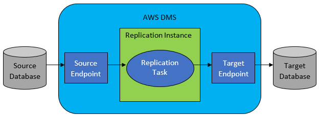

출처 : https://docs.aws.amazon.com/ko_kr/dms/latest/userguide/Welcome.html

**AWS Database Migration Service란 무엇입니까?**

AWS Database Migration Service(AWS DMS)는 관계형 데이터베이스, 데이터 웨어하우스, NoSQL 데이터베이스 및 그 밖의 데이터 스토어 유형을 쉽게 마이그레이션하도록 해주는 클라우드 서비스입니다. AWS DMS를 사용하여 AWS 클라우드로, 온프레미스 인스턴스 간에 또는 클라우드와 온프레미스가 결합된 설정 간에 데이터를 마이그레이션할 수 있습니다.

AWS DMS를 사용하면 마이그레이션을 한 번 수행할 수 있으며 지속적인 변경 사항을 복제하여 소스와 대상을 동기화 상태로 유지할 수 있습니다. 데이터베이스 엔진을 변경하려면 AWS Schema Conversion Tool(AWS SCT)을 사용하여 데이터베이스 스키마를 새로운 플랫폼으로 변환하면 됩니다. 그런 다음 AWS DMS를 사용하여 데이를 마이그레이션합니다. AWS DMS는 AWS 클라우드의 일부분이므로 AWS 제품 특유의 비용 효율성, 빠른 출시 기간, 보안 및 유연성을 제공합니다.

AWS DMS를 지원하는 AWS 리전에 대한 자세한 내용은 [AWS DMS 복제 인스턴스 작업 사용](https://docs.aws.amazon.com/ko_kr/dms/latest/userguide/CHAP_ReplicationInstance.html) 단원을 참조하십시오. 데이터베이스 마이그레이션 비용에 대한 정보는 [AWS Database Migration Service 요금 페이지](https://aws.amazon.com/dms/pricing/)를 참조하십시오.

**AWS DMS가 수행하는 마이그레이션 작업**

AWS DMS는 마이그레이션 프로젝트에 수반되는 여러 가지 어렵거나 지루한 작업을 대신합니다.

- 기존의 솔루션에서는 용량 분석을 직접 수행하고 하드웨어와 소프트웨어를 조달하며 시스템을 설치 및 관리하고 설치를 테스트 및 디버깅해야 하지만 AWS DMS에서는 마이그레이션에 필요한 모든 하드웨어 및 소프트웨어의 배포, 관리 및 모니터링을 자동으로 관리합니다. AWS DMS 구성 프로세스를 시작하고 몇 분 안에 마이그레이션을 시작하고 실행할 수 있습니다.

- AWS DMS를 사용하여 필요에 따라 실제 워크로드에 맞게 마이그레이션 리소스를 스케일 업하거나 스케일 다운할 수 있습니다. 예를 들어, 추가 스토리지가 필요하다고 판단되면 할당된 스토리지를 손쉽게 늘리고 대개 몇 분 안에 마이그레이션을 다시 시작할 수 있습니다. 반면에 구성한 리소스 용량 중 일부만 사용하는 경우에는 실제 워크로드에 맞추어 손쉽게 축소할 수 있습니다.

- AWS DMS는 사용한 만큼 지불하는 모델을 사용합니다. 구매 비용을 먼저 내고 유지 관리 비용을 지속적으로 납부하는 기존의 라이선스 모델과 반대로 AWS DMS 리소스를 사용하는 동안 그에 대한 요금만 지불합니다.

- AWS DMS는 하드웨어 및 소프트웨어, 소프트웨어 패치 및 오류 보고를 포함하여 마이그레이션 서버를 지원하는 모든 인프라를 자동으로 관리합니다.

- AWS DMS는 자동 장애 조치 기능을 제공합니다. 어떤 이유로든 기본 복제 서버가 실패해도 서비스가 거의 또는 전혀 중단되지 않고 백업 복제 서버가 그 역할을 대신합니다.

- AWS DMS를 사용하여 지금 실행하고 있는 데이터베이스 엔진에 비해 현대적이고 비용 효율적인 데이터베이스 엔진으로 전환할 수 있습니다. 예를 들어, AWS DMS를 통해 Amazon RDS 또는 Amazon Aurora가 제공하는 관리형 데이터베이스 서비스를 이용할 수 있습니다. 또는 Amazon Redshift, NoSQL 플랫폼(예: Amazon DynamoDB) 또는 저렴한 스토리지 플랫폼(예: Amazon S3)이 제공하는 관리형 데이터 웨어하우스 서비스로 쉽게 옮겨갈 수도 있습니다. 반대로, 이전의 인프라에서 마이그레이션은 진행하지만 같은 데이터베이스 엔진을 계속 사용하려는 경우에도 AWS DMS에서 해당 프로세스를 지원합니다.

- AWS DMS는 Oracle, Microsoft SQL Server, MySQL, MariaDB, PostgreSQL, Db2 LUW, SAP, MongoDB 및 Amazon Aurora를 비롯하여 오늘날 가장 널리 사용되는 거의 모든 DBMS 엔진을 데이터 원본으로 지원합니다.

- AWS DMS는 Oracle, Microsoft SQL Server, PostgreSQL, MySQL, Amazon Redshift, SAP ASE, S3 및 Amazon DynamoDB를 비롯하여 광범위한 시중 대상 엔진을 제공합니다.

- 지원되는 모든 데이터 원본에서 지원되는 모든 데이터 대상으로 마이그레이션할 수 있습니다. AWS DMS는 지원되는 엔진 간에 전혀 다른 유형의 데이터 마이그레이션을 지원합니다.

- AWS DMS는 데이터 마이그레이션의 보안을 보장합니다. AWS Key Management Service(AWS KMS) 암호화를 통해 유휴 데이터가 암호화됩니다. 마이그레이션 중에 SSL(Secure Sockets Layer)을 사용하여 데이터가 원본에서 대상으로 이동할 때 이동 중인 데이터를 암호화할 수 있습니다.

**기본 수준에서의 AWS DMS 작동 방식**

가장 기본적인 수준에서 AWS DMS는 복제 소프트웨어를 실행하는 AWS 클라우드의 서버입니다. 소스와 대상 연결을 만들어 어디에서 추출하고 어디에 로드할 것인지 AWS DMS에 알립니다. 그런 다음 데이터를 이동하기 위해 이 서버에서 실행되는 작업을 예약합니다. 테이블 및 연관된 기본 키가 대상에 없을 경우 AWS DMS가 이러한 항목을 만듭니다. 원한다면 대상 테이블을 수동으로 미리 생성할 수 있습니다. 또는 AWS SCT를 사용하여 일부 또는 전체 대상 테이블, 인덱스, 보기, 트리거 등을 생성할 수 있습니다.

다음 그림은 AWS DMS 프로세스를 보여 줍니다.

**AWS DMS 프로세스를 시작부터 끝까지 실행하려면**

1. 마이그레이션 프로젝트를 시작하려면 원본 및 대상 데이터 스토어를 식별합니다. 앞서 언급한 데이터 엔진 중 어디에나 데이터 스토어가 있을 수 있습니다.

2. 원본과 대상 모두에 대해 데이터베이스와의 연결 정보를 지정하는 엔드포인트를 AWS DMS 안에 구성합니다. 엔드포인트가 적절한 ODBC 드라이버를 사용하여 원본 및 대상과 통신합니다.

3. 복제 인스턴스를 프로비저닝합니다. 이 인스턴스는 AWS DMS가 복제 소프트웨어를 통해 자동으로 구성하는 서버입니다.

4. 마이그레이션할 실제 데이터 테이블과 적용할 데이터 변환 규칙을 지정하는 복제 작업을 생성합니다. AWS DMS는 복제 작업 실행을 관리하고 마이그레이션 프로세스에서 상태를 제공합니다.

자세한 내용은 다음을 참조하십시오.

AWS DMS를 처음 사용하지만 다른 AWS 서비스에는 익숙한 경우 [AWS Database Migration Service의 작동 방식](https://docs.aws.amazon.com/ko_kr/dms/latest/userguide/CHAP_Introduction.html)에서 시작합니다. 이 단원에서는 AWS DMS의 핵심 구성 요소와 마이그레이션을 설정하고 실행하는 전반적인 프로세스를 설명합니다.

데이터베이스 엔진을 전환하려는 경우 [AWS Schema Conversion Tool](https://docs.aws.amazon.com/SchemaConversionTool/latest/userguide/CHAP_SchemaConversionTool.Installing.html)이 테이블, 인덱스 및 대부분의 애플리케이션 코드를 비롯한 기존의 데이터베이스 스키마를 대상 플랫폼으로 변환할 수 있습니다.

마이그레이션 전략 설계에 필요한 관련 AWS 제품에 대한 자세한 내용은 [AWS 클라우드 제품](https://aws.amazon.com/products/)을 참조하십시오.

Amazon Web Services는 수많은 데이터베이스 서비스를 제공합니다. 환경에 가장 적합한 서비스에 대한 지침은 [AWS에서 데이터베이스 실행](http://aws.amazon.com/running_databases/)을 참조하십시오.

모든 AWS 제품의 개요는 [클라우드 컴퓨팅이란?](http://aws.amazon.com/what-is-aws/)을 참조하십시오.
